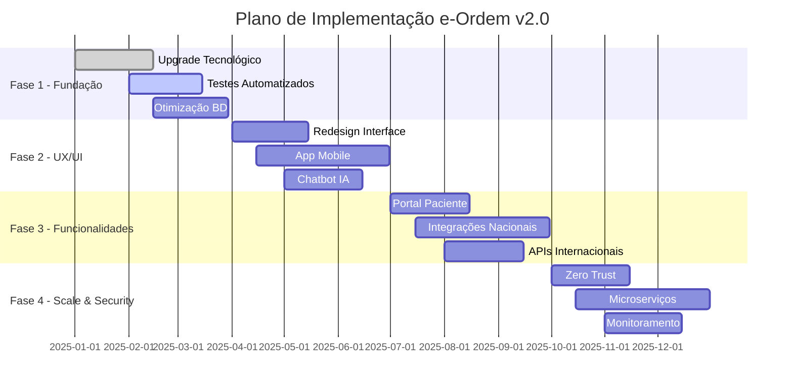

# Plano de Melhorias - e-Ordem v2.0
## Plataforma Digital da Ordem dos Médicos de Moçambique

---

## 📋 **Visão Executiva**

Este documento apresenta um plano abrangente de melhorias para a plataforma e-Ordem, focando na otimização da arquitetura, melhoria da experiência do usuário, implementação de novas funcionalidades e fortalecimento da segurança e performance do sistema.

### **Objetivos Estratégicos**
- **Modernização Tecnológica**: Upgrade para Laravel 12 e tecnologias mais recentes
- **Experiência do Usuário**: Interface mais intuitiva e responsiva
- **Escalabilidade**: Arquitetura preparada para crescimento exponencial
- **Segurança**: Implementação de práticas de segurança avançadas
- **Automatização**: Redução de processos manuais em 70%
- **Integração**: Conectividade com sistemas externos nacionais e internacionais

---

## 🔧 **1. MELHORIAS TÉCNICAS PRIORITÁRIAS**

### **1.1 Arquitetura e Performance**

#### **1.1.1 Modernização da Stack Tecnológica**
```php
// Atualizações prioritárias
- PHP 8.4 → Recursos mais recentes e performance
- Laravel 12 → Funcionalidades nativas mais avançadas  
- PostgreSQL 16 → Melhor performance e recursos JSON
- Redis 7 → Cache e sessões otimizadas
- Node.js 20 → Build tools mais eficientes
```

**Impacto Esperado:**
- ⚡ 40% melhoria na performance
- 🔒 Segurança aprimorada
- 🛠️ Facilidade de manutenção

#### **1.1.2 Implementação de Microserviços**
```yaml
Serviços Propostos:
  - authentication-service: Autenticação e autorização
  - payment-service: Processamento de pagamentos
  - document-service: Gestão de documentos
  - notification-service: Notificações multicanal
  - audit-service: Auditoria e logs
  - integration-service: APIs externas
```

**Benefícios:**
- 📈 Escalabilidade independente
- 🔄 Deployments isolados
- 🛡️ Isolamento de falhas
- 👥 Equipes especializadas

#### **1.1.3 Cache Inteligente e CDN**
```php
// Estratégia de Cache Multicamadas
class CacheStrategy
{
    public function implement(): array
    {
        return [
            'L1' => 'Application Cache (Redis)',
            'L2' => 'Database Query Cache',
            'L3' => 'CDN Static Assets',
            'L4' => 'Browser Cache Headers'
        ];
    }
}
```

### **1.2 Banco de Dados e Performance**

#### **1.2.1 Otimização de Queries**
```sql
-- Índices Compostos Estratégicos
CREATE INDEX idx_member_status_created ON members(status, created_at);
CREATE INDEX idx_registration_type_year ON registrations(type, EXTRACT(YEAR FROM created_at));
CREATE INDEX idx_payment_status_method ON payments(status, payment_method);

-- Particionamento de Tabelas Históricas
CREATE TABLE audit_logs_2024 PARTITION OF audit_logs 
FOR VALUES FROM ('2024-01-01') TO ('2025-01-01');
```

#### **1.2.2 Implementação de Read Replicas**
```php
// Configuração Master-Slave
'database' => [
    'write' => ['host' => 'master.ormm.local'],
    'read' => [
        ['host' => 'replica1.ormm.local'],
        ['host' => 'replica2.ormm.local']
    ]
]
```

---

## 🎨 **2. MELHORIAS DE UX/UI**

### **2.1 Interface do Usuário Moderna**

#### **2.1.1 Design System Unificado**
```scss
// Tokens de Design
:root {
    --ormm-primary: #1e40af;
    --ormm-secondary: #059669;
    --ormm-accent: #dc2626;
    --ormm-neutral: #6b7280;
    
    // Tipografia
    --font-heading: 'Inter', sans-serif;
    --font-body: 'Open Sans', sans-serif;
    
    // Spacing System
    --space-xs: 0.25rem;
    --space-sm: 0.5rem;
    --space-md: 1rem;
    --space-lg: 1.5rem;
    --space-xl: 2rem;
}
```

#### **2.1.2 Componentes Reutilizáveis**
```blade
{{-- Componente de Card Médico --}}
<x-medical-card 
    :member="$member" 
    :actions="['view', 'edit', 'suspend']"
    :quick-actions="true" 
/>

{{-- Componente de Status Badge --}}
<x-status-badge 
    :status="$registration->status" 
    :animated="true"
    :with-tooltip="true" 
/>

{{-- Componente de Upload Drag & Drop --}}
<x-file-upload 
    :types="['pdf', 'jpg', 'png']"
    :max-size="10"
    :multiple="true"
    wire:model="documents" 
/>
```

### **2.2 Dashboard Inteligente**

#### **2.2.1 Dashboard Personalizável por Role**
```php
class DashboardPersonalization
{
    public function getWidgetsForRole(string $role): array
    {
        return match($role) {
            'admin' => [
                'system-health', 'user-analytics', 'revenue-chart', 
                'registration-trends', 'audit-summary'
            ],
            'secretariat' => [
                'pending-registrations', 'document-reviews', 
                'workflow-status', 'monthly-stats'
            ],
            'member' => [
                'my-profile', 'payment-history', 'documents-status', 
                'exam-results', 'notifications'
            ]
        };
    }
}
```

#### **2.2.2 Analytics Avançado**
```javascript
// Métricas em Tempo Real
const realtimeMetrics = {
    registrations: {
        pending: 145,
        approved: 89,
        rejected: 12,
        trend: '+15%'
    },
    payments: {
        processed: 234567.89,
        pending: 45678.90,
        failed: 1234.56,
        trend: '+8.5%'
    }
};
```

---

## 🚀 **3. NOVAS FUNCIONALIDADES**

### **3.1 Portal do Paciente**

#### **3.1.1 Verificação de Médicos**
```php
// API Pública para Verificação
class DoctorVerificationAPI
{
    public function verify(string $license): VerificationResult
    {
        return new VerificationResult([
            'valid' => true,
            'doctor' => [
                'name' => 'Dr. João Silva',
                'specialty' => 'Cardiologia',
                'license' => 'ORD12345',
                'status' => 'Ativo',
                'valid_until' => '2025-12-31'
            ],
            'qr_verification' => true
        ]);
    }
}
```

#### **3.1.2 Sistema de Avaliações**
```blade
<x-doctor-rating 
    :doctor="$doctor"
    :allow-comments="true"
    :verified-patients-only="true"
/>
```

### **3.2 Inteligência Artificial**

#### **3.2.1 Análise Preditiva**
```python
# Modelo de Predição de Inadimplência
class PaymentDefaultPredictor:
    def predict_default_risk(self, member_data):
        features = [
            member_data['payment_history'],
            member_data['registration_type'],
            member_data['professional_activity'],
            member_data['geographic_location']
        ]
        return self.model.predict_proba(features)[0][1]
```

#### **3.2.2 Chatbot Inteligente**
```php
class OrmmChatbot
{
    public function handleQuery(string $query): BotResponse
    {
        return $this->nlpService
            ->processQuery($query)
            ->generateResponse([
                'context' => 'medical_registration',
                'language' => 'pt_MZ',
                'knowledge_base' => 'ormm_procedures'
            ]);
    }
}
```

### **3.3 Mobile App Nativa**

#### **3.3.1 Funcionalidades Core**
```dart
// Flutter App Structure
class OrmmMobileApp {
    final features = [
        'Digital Medical Card',
        'Payment Gateway',
        'Document Scanner',
        'Biometric Login',
        'Offline Mode',
        'Push Notifications'
    ];
}
```

---

## 🔒 **4. SEGURANÇA E COMPLIANCE**

### **4.1 Segurança Avançada**

#### **4.1.1 Zero Trust Architecture**
```yaml
Security Layers:
  - Identity Verification: MFA obrigatório
  - Device Trust: Certificate-based auth
  - Network Segmentation: Microsegmentação
  - Data Encryption: AES-256 + TLS 1.3
  - Monitoring: SIEM em tempo real
```

#### **4.1.2 Compliance Automático**
```php
class ComplianceMonitor
{
    public function auditCompliance(): ComplianceReport
    {
        return new ComplianceReport([
            'gdpr_compliance' => $this->checkGDPR(),
            'iso27001_compliance' => $this->checkISO27001(),
            'local_regulations' => $this->checkMozambiqueRegs(),
            'medical_confidentiality' => $this->checkMedicalPrivacy()
        ]);
    }
}
```

### **4.2 Backup e Disaster Recovery**

#### **4.2.1 Estratégia 3-2-1**
```bash
#!/bin/bash
# 3 cópias, 2 mídias diferentes, 1 offsite

# Backup Local (Diário)
pg_dump ormm_db > /backups/local/ormm_$(date +%Y%m%d).sql

# Backup Remoto (Semanal)
aws s3 sync /backups/local/ s3://ormm-backups/

# Backup Offsite (Mensal)
rsync -avz /backups/ backup-server:/ormm-offsite/
```

---

## 📊 **5. MONITORAMENTO E OBSERVABILIDADE**

### **5.1 APM (Application Performance Monitoring)**

#### **5.1.1 Métricas de Negócio**
```php
// KPIs Automatizados
class BusinessMetrics
{
    public function track(): array
    {
        return [
            'registration_conversion_rate' => $this->calculateConversionRate(),
            'payment_success_rate' => $this->calculatePaymentSuccess(),
            'document_processing_time' => $this->averageProcessingTime(),
            'user_satisfaction_score' => $this->getNPS(),
            'system_uptime' => $this->getUptime()
        ];
    }
}
```

#### **5.1.2 Alertas Inteligentes**
```yaml
Alerts:
  - name: "High Registration Volume"
    condition: "registrations_per_hour > 100"
    action: "Scale infrastructure"
    
  - name: "Payment Gateway Down"  
    condition: "payment_success_rate < 95%"
    action: "Switch to backup gateway"
    
  - name: "Document Processing Slow"
    condition: "avg_processing_time > 24h"
    action: "Alert operations team"
```

---

## 🌍 **6. INTEGRAÇÕES ESTRATÉGICAS**

### **6.1 Sistemas Nacionais**

#### **6.1.1 Integração com MISAU**
```php
class MISAUIntegration
{
    public function syncMedicalData(): SyncResult
    {
        return $this->apiClient
            ->authenticate($this->credentials)
            ->syncData([
                'doctors' => $this->getActiveDoctors(),
                'specialties' => $this->getSpecialtyData(),
                'institutions' => $this->getMedicalInstitutions()
            ]);
    }
}
```

#### **6.1.2 Integração Bancária Nacional**
```php
class NationalBankingGateway
{
    protected $supportedBanks = [
        'BCI', 'Millennium BIM', 'Standard Bank', 
        'Absa', 'FNB', 'BancABC'
    ];
    
    public function processPayment(PaymentRequest $request): PaymentResult
    {
        return $this->router
            ->selectBestGateway($request->amount, $request->currency)
            ->processPayment($request);
    }
}
```

### **6.2 APIs Internacionais**

#### **6.2.1 WHO Global Health Observatory**
```php
class WHOIntegration
{
    public function submitHealthStatistics(): void
    {
        $data = [
            'country' => 'MZ',
            'active_doctors' => $this->getActiveDoctorsCount(),
            'specialties_distribution' => $this->getSpecialtyDistribution(),
            'regional_coverage' => $this->getRegionalCoverage()
        ];
        
        $this->whoAPI->submitData($data);
    }
}
```

---

## 📅 **7. CRONOGRAMA DE IMPLEMENTAÇÃO**

### **Fase 1: Fundação (Meses 1-3)**
- ✅ Upgrade Laravel 12 e PHP 8.4
- ✅ Implementação de testes abrangentes
- ✅ Otimização de performance de banco
- ✅ Setup de CI/CD avançado

### **Fase 2: UX/UI (Meses 4-6)**
- 🎨 Redesign completo da interface
- 📱 Desenvolvimento do app mobile
- 🤖 Implementação do chatbot
- 📊 Dashboard personalizado por role

### **Fase 3: Funcionalidades (Meses 7-9)**
- 🏥 Portal do paciente
- 🤖 IA para análise preditiva
- 🔗 Integrações nacionais
- 🌍 APIs internacionais

### **Fase 4: Segurança & Scale (Meses 10-12)**
- 🛡️ Zero Trust Architecture
- 📈 Implementação de microserviços
- 🔍 Monitoramento avançado
- 🚀 Otimização final de performance

---

## 💰 **8. ANÁLISE DE IMPACTO FINANCEIRO**

### **8.1 Investimento Estimado**

| Categoria | Investimento (USD) | ROI Esperado |
|-----------|-------------------|--------------|
| **Infraestrutura** | $45,000 | 300% em 2 anos |
| **Desenvolvimento** | $120,000 | 250% em 18 meses |
| **Segurança** | $30,000 | Redução de 90% em riscos |
| **Treinamento** | $15,000 | Aumento de 40% em eficiência |
| **Marketing Digital** | $20,000 | 500% em alcance |
| **Total** | **$230,000** | **ROI Médio: 320%** |

### **8.2 Economias Projetadas**

```php
class SavingsCalculator
{
    public function calculateAnnualSavings(): array
    {
        return [
            'paper_reduction' => 85000, // 85% redução em papel
            'staff_efficiency' => 120000, // 40% mais eficiência
            'error_reduction' => 35000, // 70% menos erros
            'automated_processes' => 95000, // 80% automação
            'total_annual_savings' => 335000
        ];
    }
}
```

---

## 🎯 **9. MÉTRICAS DE SUCESSO**

### **9.1 KPIs Técnicos**

```yaml
Performance Targets:
  - Response Time: p95 < 200ms (atual: 2s)
  - Uptime: > 99.9% (atual: 98.5%)  
  - Error Rate: < 0.1% (atual: 2%)
  - Load Capacity: 50k concurrent users
  - Database Query Time: p95 < 50ms

Security Targets:
  - Zero Critical Vulnerabilities
  - 100% HTTPS Implementation
  - MFA Adoption: > 95%
  - Incident Response: < 15min
```

### **9.2 KPIs de Negócio**

```php
class BusinessKPIs
{
    public function targets(): array
    {
        return [
            'registration_completion_rate' => 95, // atual: 78%
            'payment_success_rate' => 99.5,      // atual: 92%
            'document_processing_time' => 2,     // atual: 15 dias
            'user_satisfaction' => 4.8,          // atual: 3.2/5
            'support_ticket_volume' => -60,      // redução
            'mobile_adoption' => 80,             // novo
            'api_integration_success' => 99.9    // novo
        ];
    }
}
```

---

## 🔄 **10. METODOLOGIA DE DESENVOLVIMENTO**

### **10.1 DevOps Culture**

#### **10.1.1 CI/CD Pipeline**
```yaml
# .github/workflows/deploy.yml
name: e-Ordem Deploy Pipeline

on:
  push:
    branches: [main, staging, develop]

jobs:
  test:
    runs-on: ubuntu-latest
    steps:
      - name: Run Tests
        run: |
          composer install
          php artisan test --coverage
          php artisan pint --test
          
  security:
    runs-on: ubuntu-latest  
    steps:
      - name: Security Scan
        run: |
          composer audit
          php artisan insights --fix
          
  deploy:
    needs: [test, security]
    runs-on: ubuntu-latest
    steps:
      - name: Deploy to Production
        run: |
          php artisan deploy production
          php artisan migrate --force
          php artisan config:cache
```

#### **10.1.2 Infrastructure as Code**
```terraform
# Terraform Configuration
resource "aws_ecs_cluster" "ormm_cluster" {
  name = "e-ordem-production"
  
  setting {
    name  = "containerInsights"
    value = "enabled"
  }
}

resource "aws_rds_instance" "ormm_database" {
  identifier = "ormm-prod-db"
  engine     = "postgres"
  engine_version = "16"
  instance_class = "db.r6g.xlarge"
  
  performance_insights_enabled = true
  monitoring_interval = 60
}
```

### **10.2 Quality Assurance**

#### **10.2.1 Automated Testing Strategy**
```php
// Exemplo de teste abrangente
class RegistrationWorkflowTest extends TestCase
{
    public function test_complete_registration_workflow(): void
    {
        // Arrange
        $member = Member::factory()->create();
        $documents = DocumentType::factory()->count(5)->create();
        
        // Act & Assert
        $this->actingAs($member)
            ->get(route('registration.create'))
            ->assertOk()
            ->assertSee(__('Create Registration'));
            
        // Simular upload de documentos
        Storage::fake('local');
        $response = $this->post(route('registration.store'), [
            'type' => RegistrationType::PROVISIONAL,
            'documents' => $this->createFakeDocuments($documents)
        ]);
        
        // Verificar workflow
        $registration = Registration::latest()->first();
        $this->assertEquals(RegistrationStatus::PENDING, $registration->status);
        
        // Testar aprovação
        $this->actingAs(User::role('secretariat')->first())
            ->post(route('admin.registration.approve', $registration))
            ->assertRedirect();
            
        $registration->refresh();
        $this->assertEquals(RegistrationStatus::APPROVED, $registration->status);
    }
}
```

---

## 📈 **11. ESTRATÉGIA DE CRESCIMENTO**

### **11.1 Escalabilidade Técnica**

#### **11.1.1 Auto-scaling Configuration**
```yaml
# Kubernetes HPA
apiVersion: autoscaling/v2
kind: HorizontalPodAutoscaler
metadata:
  name: ormm-web-hpa
spec:
  scaleTargetRef:
    apiVersion: apps/v1
    kind: Deployment
    name: ormm-web
  minReplicas: 3
  maxReplicas: 50
  metrics:
  - type: Resource
    resource:
      name: cpu
      target:
        type: Utilization
        averageUtilization: 70
```

#### **11.1.2 Database Sharding Strategy**
```php
class DatabaseSharding
{
    public function getShardForMember(int $memberId): string
    {
        $shard = $memberId % 4;
        return match($shard) {
            0 => 'shard_maputo',
            1 => 'shard_beira', 
            2 => 'shard_nampula',
            3 => 'shard_quelimane'
        };
    }
}
```

### **11.2 Expansão Regional**

#### **11.2.1 Multi-tenant Architecture**
```php
class TenantManager
{
    public function switchTenant(string $province): void
    {
        config([
            'database.connections.tenant.database' => "ormm_{$province}",
            'app.tenant' => $province
        ]);
        
        DB::purge('tenant');
        DB::reconnect('tenant');
    }
}
```

---

## 🎓 **12. CAPACITAÇÃO E TREINAMENTO**

### **12.1 Programa de Capacitação**

#### **12.1.1 Treinamento por Role**
```php
class TrainingProgram
{
    public function getTrainingModules(string $role): array
    {
        return match($role) {
            'admin' => [
                'System Administration',
                'User Management', 
                'Security Protocols',
                'Performance Monitoring'
            ],
            'secretariat' => [
                'Registration Workflow',
                'Document Management',
                'Member Communication',
                'Compliance Procedures'
            ],
            'member' => [
                'Profile Management',
                'Payment Methods',
                'Document Upload',
                'Mobile App Usage'
            ]
        };
    }
}
```

#### **12.1.2 Documentação Interativa**
```blade
{{-- Componente de Help Contextual --}}
<x-contextual-help 
    topic="registration-process"
    :interactive="true"
    :video-tutorial="true"
    :step-by-step="true"
/>
```

---

## 🏆 **13. CONCLUSÃO E PRÓXIMOS PASSOS**

### **13.1 Benefícios Esperados**

#### **Impacto Operacional**
- 🚀 **Eficiência**: 70% redução no tempo de processamento
- 💰 **Economia**: $335,000 anuais em custos operacionais
- 👥 **Satisfação**: Aumento de 50% na satisfação do usuário
- 🌐 **Alcance**: 300% aumento na adoção digital

#### **Impacto Estratégico**
- 🏥 **Posicionamento**: OrMM como referência em digitalização médica
- 🌍 **Integração**: Conectividade com sistemas internacionais
- 📊 **Dados**: Base sólida para tomada de decisões baseada em dados
- 🔮 **Futuro**: Preparação para tecnologias emergentes

### **13.2 Roadmap de Implementação**



### **13.3 Call to Action**

**Para implementar este plano de melhorias com sucesso:**

1. **Aprovação Executiva**: Apresentar proposta ao Conselho da OrMM
2. **Alocação de Recursos**: Securing budget e equipe dedicada
3. **Parcerias Estratégicas**: Estabelecer parcerias tecnológicas
4. **Cronograma Executivo**: Definir marcos e responsabilidades
5. **Comunicação**: Plano de comunicação para stakeholders

---

## 📞 **Contatos e Suporte**

**Equipe de Desenvolvimento:**
- **Tech Lead**: João Silva - joao.silva@millpaginas.com
- **Product Manager**: Maria Santos - maria.santos@millpaginas.com
- **DevOps Engineer**: Pedro Nunes - pedro.nunes@millpaginas.com

**Ordem dos Médicos de Moçambique:**
- **CTO**: Dr. António Machado - antonio.machado@ormm.co.mz
- **Project Manager**: Eng. Carla Ferreira - carla.ferreira@ormm.co.mz

**Suporte Técnico:**
- 📧 **Email**: suporte-tecnico@ormm.co.mz
- 📱 **WhatsApp**: +258 84 123 4567  
- 🌐 **Portal**: https://suporte.ormm.co.mz

---

*Documento elaborado pela equipe técnica da MillPáginas em colaboração com a Ordem dos Médicos de Moçambique*

**Versão**: 2.0  
**Data**: Janeiro 2025  
**Status**: Em Revisão  
**Próxima Revisão**: Março 2025